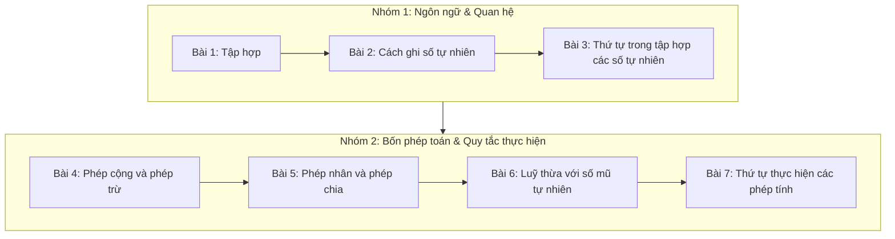

# Ôn tập Chương 1: Tập hợp các số tự nhiên

Chương I là nền tảng số học mở đầu chương trình Toán 6, kết nối liền mạch 7 bài học trọng tâm: từ hệ thống ngôn ngữ và quan hệ tập hợp (Bài 1, Bài 2, Bài 3) đến các phép toán số học và quy tắc thực hiện (Bài 4, Bài 5, Bài 6, Bài 7).

Bài viết này hệ thống hóa toàn bộ kiến thức cốt lõi của Chương I, tổng hợp các dạng toán thực tế, 5 chuyên đề bồi dưỡng học sinh giỏi và 3 đề kiểm tra 45 phút có trắc nghiệm tương tác kèm lời giải chi tiết.

---

## Phần I. Hệ thống kiến thức cốt lõi Chương I

### 1. Sơ đồ mạch kiến thức

Mạch kiến thức 7 bài học được kết nối chặt chẽ theo sơ đồ:



---

### 2. Bảng tóm tắt 7 bài học trọng tâm

| Bài | Kiến thức cốt lõi & Công thức cần nhớ | Ví dụ minh hoạ |
| :--- | :--- | :--- |
| **Bài 1: Tập hợp** | • Kí hiệu phần tử thuộc $\in$, không thuộc $\notin.$<br>• Hai cách viết tập hợp: Liệt kê các phần tử $\{ \}$ hoặc Chỉ ra tính chất đặc trưng.<br>• Tập hợp $\mathbb{N} = \{0; 1; 2; \dots\}$ và $\mathbb{N}^* = \{1; 2; 3; \dots\}.$<br>• Mỗi phần tử chỉ viết đúng một lần, thứ tự liệt kê tùy ý. | $A = \{x \in \mathbb{N} \mid x < 4\} = \{0; 1; 2; 3\}.$<br>$3 \in A,\; 5 \notin A.$ |
| **Bài 2: Cách ghi số tự nhiên** | • Hệ thập phân: Dùng 10 chữ số $0, 1, \dots, 9$; giá trị mỗi chữ số phụ thuộc vào hàng.<br>• Phân tích số theo cấu tạo hàng: $\overline{ab} = 10a + b;\; \overline{abc} = 100a + 10b + c.$<br>• Chữ số La Mã: I (1), V (5), X (10), L (50), C (100). | $\overline{ab} = 10a + b.$<br>$3524 = 3000 + 500 + 20 + 4.$<br>$\text{XIV} = 14.$ |
| **Bài 3: Thứ tự trong tập hợp các số tự nhiên** | • Tia số: Số biểu diễn bên trái nhỏ hơn số biểu diễn bên phải.<br>• Hai số tự nhiên liên tiếp hơn kém nhau $1$ đơn vị.<br>• Số $0$ là số tự nhiên nhỏ nhất; tập hợp $\mathbb{N}$ không có số lớn nhất.<br>• Kí hiệu $<, >, \le, \ge$ và tính chất bắc cầu ($a < b$ và $b < c \implies a < c$). | Liền sau của $99$ là $100.$<br>$\{x \in \mathbb{N} \mid 2 < x \le 5\} = \{3; 4; 5\}.$ |
| **Bài 4: Phép cộng và phép trừ** | • $\text{Số hạng} + \text{Số hạng} = \text{Tổng};\; \text{Số bị trừ} - \text{Số trừ} = \text{Hiệu}.$<br>• Tính chất phép cộng: Giao hoán, kết hợp, cộng với số $0.$<br>• Điều kiện thực hiện phép trừ trong $\mathbb{N}$: Số bị trừ $\ge$ số trừ ($a \ge b$).<br>• Tìm số chưa biết qua quan hệ thành phần phép tính. | $37 + 64 + 36 = 37 + (64 + 36) = 137.$<br>Tìm $x$: $x - 15 = 8 \implies x = 23.$ |
| **Bài 5: Phép nhân và phép chia** | • $\text{Thừa số} \cdot \text{Thừa số} = \text{Tích}.$<br>• Tính chất phân phối: $a(b + c) = ab + ac;\; a(b - c) = ab - ac.$<br>• Phép chia hết: $a : b = q \iff a = b \cdot q.$<br>• Phép chia có dư: $a = b \cdot q + r$ ($0 < r < b$). **Tuyệt đối không chia cho số $0.$** | $32 \cdot 47 + 32 \cdot 53 = 32 \cdot 100 = 3200.$<br>$47 = 5 \cdot 9 + 2$ (dư $2 < 5$). |
| **Bài 6: Luỹ thừa với số mũ tự nhiên** | • $a^n = \underbrace{a \cdot a \cdots a}_{n \text{ thừa số}}$ ($a$ là cơ số, $n$ là số mũ).<br>• Quy ước: $a^1 = a;\; a^0 = 1$ ($a \neq 0$).<br>• Nhân cùng cơ số: $a^m \cdot a^n = a^{m+n}.$ Chia cùng cơ số: $a^m : a^n = a^{m-n}$ ($a \neq 0, m \ge n$).<br>• Số chính phương là bình phương của một số tự nhiên: $0, 1, 4, 9, 16, 25, \dots$ | $2^3 \cdot 2^4 = 2^7.$<br>$3^{10} : 3^7 = 3^3.$<br>$2^5 = 32.$ |
| **Bài 7: Thứ tự thực hiện các phép tính** | • Không có ngoặc: $\text{Luỹ thừa} \to \text{Nhân, chia} \to \text{Cộng, trừ}$ (nếu chỉ có cộng trừ hoặc nhân chia thì tính từ trái sang phải).<br>• Có dấu ngoặc: $( \ ) \to [ \ ] \to \{ \ \}.$<br>• Biểu thức có chứa chữ: Thay giá trị vào rồi tính theo đúng thứ tự. | $5 \cdot 2^3 = 5 \cdot 8 = 40.$<br>$80 - [70 - (12 - 4)^2] = 80 - 6 = 74.$ |

---

### 3. Các sai lầm kinh điển học sinh hay mắc phải

> [!WARNING] Hãy ghi nhớ và tránh các lỗi sai phổ biến sau:
> 1. **Phép trừ trong tập hợp $\mathbb{N}$:** Chỉ thực hiện được $a - b$ khi $a \ge b.$ Biểu thức như $8 - 15$ chưa thực hiện được trong tập số tự nhiên.
> 2. **Phép chia có dư:** Số dư $r$ bắt buộc phải thỏa mãn $0 \le r < b.$ Viết $17 = 3 \cdot 4 + 5$ là sai quy tắc vì số dư $5$ lớn hơn số chia $3.$
> 3. **Hiểu sai bản chất luỹ thừa:** $a^n \neq a \cdot n.$ Viết $2^3 = 6$ là sai, đúng phải là $2^3 = 2 \cdot 2 \cdot 2 = 8.$
> 4. **Nhân cùng cơ số:** Chỉ cộng số mũ và giữ nguyên cơ số: $2^3 \cdot 2^4 = 2^7$ (không nhân cơ số thành $4^7,$ không nhân số mũ thành $2^{12}$).
> 5. **Phép cộng không gộp số mũ:** $2^3 + 2^2 = 8 + 4 = 12$ (không được viết thành $2^5 = 32$).
> 6. **Bình phương của một tổng:** $(a + b)^2 \neq a^2 + b^2.$ Chẳng hạn $(5 + 12)^2 = 17^2 = 289,$ trong khi $5^2 + 12^2 = 25 + 144 = 169.$
> 7. **Thứ tự thực hiện phép tính:** Biểu thức $2 \cdot 4^2 = 2 \cdot 16 = 32$ (phải tính luỹ thừa trước, không lấy $(2 \cdot 4)^2 = 8^2 = 64$). Dãy chỉ có cộng và trừ phải tính tuần tự từ trái sang phải.

---

## Phần II. Bài toán tổng hợp (Liên kết nhiều bài)

Mỗi ví dụ dưới đây kết hợp nhiều mảng kiến thức đã học trong chương:

### Ví dụ minh hoạ

**Ví dụ 1.** Tính một cách hợp lí:
a) $32 \cdot 47 + 32 \cdot 53;$
b) $1 + 2 + 3 + \dots + 50.$

<details>
<summary><strong>Xem lời giải Ví dụ 1</strong></summary>

a) Dùng tính chất phân phối của phép nhân đối với phép cộng (Bài 5):
$$32 \cdot 47 + 32 \cdot 53 = 32 \cdot (47 + 53) = 32 \cdot 100 = 3200.$$

b) Áp dụng phương pháp ghép cặp Gauss tính tổng dãy số cách đều (Bài 4):
Dãy có $50$ số hạng. Ghép cặp đầu và cuối: $(1 + 50) = 51,\; (2 + 49) = 51,\; \dots$
Số cặp ghép được là: $50 : 2 = 25$ cặp.
Tổng cần tìm là:
$$S = 51 \cdot 25 = 1275.$$
*(Công thức nhanh: $S = (1 + 50) \cdot 50 : 2 = 1275$).*

</details>

**Ví dụ 2.** Thực hiện phép tính:
a) $2 \cdot 3^2 + 4^3 : 8;$
b) $80 - [130 - (12 - 4)^2].$

<details>
<summary><strong>Xem lời giải Ví dụ 2</strong></summary>

a) Luỹ thừa trước, sau đó nhân chia, cuối cùng cộng (Bài 6, Bài 7):
$$2 \cdot 3^2 + 4^3 : 8 = 2 \cdot 9 + 64 : 8 = 18 + 8 = 26.$$

b) Mở ngoặc tròn trước, tính luỹ thừa, rồi ngoặc vuông (Bài 7):
$$80 - [130 - (12 - 4)^2] = 80 - [130 - 8^2] = 80 - [130 - 64] = 80 - 66 = 14.$$

</details>

**Ví dụ 3.** Tìm số tự nhiên $x$, biết:
a) $2 \cdot (x - 5) + 3^2 = 5^2;$
b) $3^x : 3^2 = 27.$

<details>
<summary><strong>Xem lời giải Ví dụ 3</strong></summary>

a) Tính các luỹ thừa: $3^2 = 9;\; 5^2 = 25.$
$$2 \cdot (x - 5) + 9 = 25$$
$$2 \cdot (x - 5) = 25 - 9 = 16$$
$$x - 5 = 16 : 2 = 8$$
$$x = 8 + 5 = 13.$$

b) Chia hai luỹ thừa cùng cơ số:
$$3^{x-2} = 3^3 \implies x - 2 = 3 \implies x = 5.$$

</details>

**Ví dụ 4.** Viết số $2025$ thành tổng các luỹ thừa của $10.$ Từ đó cho biết chữ số $2$ ở hàng nghìn và chữ số $2$ ở hàng chục có giá trị bằng bao nhiêu?

<details>
<summary><strong>Xem lời giải Ví dụ 4</strong></summary>

Phân tích theo các hàng (Bài 2, Bài 6):
$$2025 = 2 \cdot 10^3 + 0 \cdot 10^2 + 2 \cdot 10^1 + 5 \cdot 10^0.$$
- Chữ số $2$ ở hàng nghìn có giá trị là: $2 \cdot 10^3 = 2000.$
- Chữ số $2$ ở hàng chục có giá trị là: $2 \cdot 10^1 = 20.$
Cùng là chữ số $2$ nhưng giá trị biểu diễn khác nhau tùy thuộc vào vị trí hàng mà nó đứng.

</details>

**Ví dụ 5 (Bài toán thực tế làm tròn lên).** Một trường học tổ chức cho $1234$ học sinh đi tham quan. Mỗi xe ô tô chở được nhiều nhất $45$ học sinh. Hỏi cần ít nhất bao nhiêu xe để chở hết toàn bộ số học sinh đó?

<details>
<summary><strong>Xem lời giải Ví dụ 5</strong></summary>

Thực hiện phép chia có dư (Bài 5):
$$1234 = 45 \cdot 27 + 19 \quad (1234 : 45 = 27 \text{ dư } 19).$$
Nếu xếp vào $27$ xe thì mới chở được $45 \cdot 27 = 1215$ học sinh, còn dư $19$ học sinh chưa có chỗ. Do đó nhà trường cần thuê thêm $1$ xe nữa để chở nốt các em này.
Số xe ít nhất cần dùng là:
$$27 + 1 = 28\text{ (xe)}.$$
**Đáp số:** $28$ xe.

</details>

**Ví dụ 6 (Bài toán thực tế luỹ thừa).** Một loại vi khuẩn cứ sau mỗi giờ lại phân đôi một lần. Ban đầu có $5$ con. Hỏi sau $8$ giờ có tất cả bao nhiêu con vi khuẩn? Viết kết quả dưới dạng luỹ thừa rồi tính giá trị.

<details>
<summary><strong>Xem lời giải Ví dụ 6</strong></summary>

Sau mỗi giờ số vi khuẩn gấp đôi, nên sau $8$ giờ số lượng vi khuẩn là:
$$5 \cdot 2^8\text{ (con)}.$$
Ta có $2^8 = 256.$
Số lượng vi khuẩn sau $8$ giờ là:
$$5 \cdot 256 = 1280\text{ (con)}.$$
**Đáp số:** $1280$ con vi khuẩn.

</details>

---

### Bài tập tự luyện phần Tổng hợp

#### Luyện tập 1
Tính một cách hợp lí:
a) $45 \cdot 28 + 45 \cdot 72 - 2000;$
b) $1 + 2 + 3 + \dots + 40.$

<details>
<summary><strong>Xem lời giải Luyện tập 1</strong></summary>

a) 
$$45 \cdot 28 + 45 \cdot 72 - 2000 = 45 \cdot (28 + 72) - 2000 = 45 \cdot 100 - 2000 = 4500 - 2000 = 2500.$$

b) Tổng dãy cách đều gồm $40$ số hạng:
$$S = (1 + 40) \cdot 40 : 2 = 41 \cdot 20 = 820.$$

</details>

#### Luyện tập 2
Tính giá trị biểu thức:
a) $3 \cdot 2^4 - 5^2 : 5;$
b) $120 - [40 + (2^3 - 3) \cdot 4].$

<details>
<summary><strong>Xem lời giải Luyện tập 2</strong></summary>

a) 
$$3 \cdot 2^4 - 5^2 : 5 = 3 \cdot 16 - 25 : 5 = 48 - 5 = 43.$$

b) 
$$120 - [40 + (2^3 - 3) \cdot 4] = 120 - [40 + (8 - 3) \cdot 4]$$
$$= 120 - [40 + 5 \cdot 4] = 120 - [40 + 20] = 120 - 60 = 60.$$

</details>

#### Luyện tập 3
Tìm số tự nhiên $x$, biết:
a) $3 \cdot (x - 4) + 2^2 = 5^2;$
b) $2^x \cdot 5 = 160.$

<details>
<summary><strong>Xem lời giải Luyện tập 3</strong></summary>

a) 
$$3 \cdot (x - 4) + 4 = 25$$
$$3 \cdot (x - 4) = 25 - 4 = 21$$
$$x - 4 = 21 : 3 = 7$$
$$x = 7 + 4 = 11.$$

b) 
$$2^x = 160 : 5 = 32.$$
Vì $32 = 2^5$ nên $2^x = 2^5 \implies x = 5.$

</details>

#### Luyện tập 4
Viết số $3406$ thành tổng các luỹ thừa của $10.$ Chữ số $4$ trong số đó có giá trị bằng bao nhiêu?

<details>
<summary><strong>Xem lời giải Luyện tập 4</strong></summary>

$$3406 = 3 \cdot 10^3 + 4 \cdot 10^2 + 0 \cdot 10^1 + 6 \cdot 10^0.$$
Chữ số $4$ đứng ở hàng trăm nên có giá trị là:
$$4 \cdot 10^2 = 400.$$

</details>

#### Luyện tập 5
Một xưởng sản xuất xếp $1000$ chiếc bánh vào các hộp, mỗi hộp đựng được nhiều nhất $24$ chiếc. Hỏi cần ít nhất bao nhiêu hộp và hộp cuối cùng đựng bao nhiêu chiếc bánh?

<details>
<summary><strong>Xem lời giải Luyện tập 5</strong></summary>

Thực hiện phép chia:
$$1000 = 24 \cdot 41 + 16 \quad (1000 : 24 = 41 \text{ dư } 16).$$
Cần $41$ hộp đựng đầy và thêm $1$ hộp nữa đựng $16$ chiếc bánh còn dư.
Vậy cần ít nhất $41 + 1 = 42$ hộp; hộp cuối cùng chứa đúng $16$ chiếc bánh.

</details>

#### Luyện tập 6
Một tế bào cứ sau mỗi $20$ phút lại phân đôi một lần. Ban đầu có $1$ tế bào. Hỏi sau $2$ giờ có bao nhiêu tế bào? Viết kết quả dưới dạng luỹ thừa của $2$ rồi tính giá trị.

<details>
<summary><strong>Xem lời giải Luyện tập 6</strong></summary>

Đổi $2\text{ giờ} = 120\text{ phút}.$
Số lần phân đôi trong $2$ giờ là:
$$120 : 20 = 6\text{ (lần)}.$$
Số tế bào tạo thành sau $6$ lần phân đôi là:
$$2^6 = 64\text{ (tế bào)}.$$
**Đáp số:** $64$ tế bào.

</details>

---

## Phần III. Năm chuyên đề bồi dưỡng học sinh giỏi

### Chuyên đề 1. Dãy số viết theo quy luật và tính tổng

> **Công thức dãy số cách đều:**
> Cho dãy số cách đều $a_1, a_2, \dots, a_n$ có khoảng cách giữa hai số liên tiếp là $d$:
> - Số số hạng: $n = (a_n - a_1) : d + 1.$
> - Số hạng thứ $n$: $a_n = a_1 + (n - 1) \cdot d.$
> - Tổng của dãy: $S = (a_1 + a_n) \cdot n : 2.$

#### Nâng cao 1
Cho dãy số $5; 9; 13; 17; 21; \dots$
a) Tìm số hạng thứ $10$ và công thức tính số hạng thứ $n$ của dãy.
b) Tính tổng $100$ số hạng đầu tiên của dãy.

<details>
<summary><strong>Xem lời giải Nâng cao 1</strong></summary>

Dãy số cách đều có khoảng cách $d = 4$ và số hạng đầu $a_1 = 5.$
a) 
- Số hạng thứ $10$: $a_{10} = 5 + (10 - 1) \cdot 4 = 5 + 36 = 41.$
- Số hạng thứ $n$: $a_n = 5 + (n - 1) \cdot 4 = 4n + 1.$

b) 
- Số hạng thứ $100$ là: $a_{100} = 4 \cdot 100 + 1 = 401.$
- Tổng $100$ số hạng đầu tiên:
$$S = \frac{(5 + 401) \cdot 100}{2} = 406 \cdot 50 = 20300.$$

</details>

#### Nâng cao 2
a) Tính tổng $S = 2 + 4 + 6 + \dots + 98.$
b) Tìm số tự nhiên $n$, biết: $3 + 4 + 5 + \dots + n = 525.$

<details>
<summary><strong>Xem lời giải Nâng cao 2</strong></summary>

a) Dãy số chẵn cách đều $d = 2.$ Số số hạng: $(98 - 2) : 2 + 1 = 49.$
$$S = (2 + 98) \cdot 49 : 2 = 100 \cdot 49 : 2 = 2450.$$

b) Cộng thêm $1 + 2$ vào cả hai vế:
$$1 + 2 + 3 + 4 + \dots + n = 525 + (1 + 2) = 528$$
$$\frac{n(n + 1)}{2} = 528 \implies n(n + 1) = 1056.$$
Vì $n$ và $n + 1$ là hai số tự nhiên liên tiếp và $1056 = 32 \cdot 33$, suy ra $n = 32.$

</details>

#### Nâng cao 3
Tìm số tự nhiên $x$, biết:
$$(x + 2) + (4x + 4) + (7x + 6) + \dots + (25x + 18) + (28x + 20) = 1560.$$

<details>
<summary><strong>Xem lời giải Nâng cao 3</strong></summary>

Tách riêng các số hạng chứa $x$ và các số hạng tự do:
$$(1 + 4 + 7 + \dots + 28) \cdot x + (2 + 4 + 6 + \dots + 20) = 1560.$$
- Dãy $1; 4; 7; \dots; 28$ có khoảng cách $3$: số số hạng là $(28 - 1) : 3 + 1 = 10.$
  Tổng hệ số của $x$: $(1 + 28) \cdot 10 : 2 = 145.$
- Dãy $2; 4; 6; \dots; 20$ có $10$ số hạng.
  Tổng phần tự do: $(2 + 20) \cdot 10 : 2 = 110.$

Phương trình trở thành:
$$145x + 110 = 1560$$
$$145x = 1450 \implies x = 10.$$

</details>

---

### Chuyên đề 2. Chữ số tận cùng của một luỹ thừa

> **Mẹo chu kì tìm chữ số tận cùng:**
> - Các số tận cùng là $0; 1; 5; 6$ khi nâng lên luỹ thừa luôn giữ nguyên chữ số tận cùng.
> - Đưa về tận cùng $1$ hoặc $6$:
>   - $(\dots 2)^4 = \dots 6;\; (\dots 3)^4 = \dots 1;\; (\dots 7)^4 = \dots 1;\; (\dots 8)^4 = \dots 6.$
>   - $(\dots 4)^2 = \dots 6;\; (\dots 9)^2 = \dots 1.$

#### Nâng cao 4
Tìm chữ số tận cùng của $3^{2015}.$

<details>
<summary><strong>Xem lời giải Nâng cao 4</strong></summary>

Vì $3^4 = 81$ có tận cùng là $1$, ta phân tích số mũ $2015$ theo bội của $4$:
$$2015 = 4 \cdot 503 + 3.$$
Khi đó:
$$3^{2015} = (3^4)^{503} \cdot 3^3 = (\dots 1)^{503} \cdot 27 = (\dots 1) \cdot 27 = \dots 7.$$
Vậy chữ số tận cùng của $3^{2015}$ là $7.$

</details>

#### Nâng cao 5
Tìm chữ số tận cùng của:
a) $7^{35} - 4^{31};$
b) $2^{1930} \cdot 9^{1945}.$

<details>
<summary><strong>Xem lời giải Nâng cao 5</strong></summary>

a) 
- $7^{35} = (7^4)^8 \cdot 7^3 = (\dots 1)^8 \cdot 343 = (\dots 1) \cdot 343 = \dots 3.$
- $4^{31} = (4^2)^{15} \cdot 4 = (\dots 6)^{15} \cdot 4 = (\dots 6) \cdot 4 = \dots 4.$
Vì chữ số hàng đơn vị $\dots 3 < \dots 4$ nên khi trừ ta mượn $1$ ở hàng chục: $13 - 4 = 9.$
Vậy $7^{35} - 4^{31}$ có chữ số tận cùng là $9.$

b) 
- $2^{1930} = (2^4)^{482} \cdot 2^2 = (\dots 6) \cdot 4 = \dots 4.$
- $9^{1945} = (9^2)^{972} \cdot 9 = (\dots 1) \cdot 9 = \dots 9.$
Tích hai số có tận cùng bằng chữ số tận cùng của $4 \cdot 9 = 36,$ tức bằng $6.$
Vậy $2^{1930} \cdot 9^{1945}$ có chữ số tận cùng là $6.$

</details>

#### Nâng cao 6
Tìm hai chữ số tận cùng của $6^{2011}.$

<details>
<summary><strong>Xem lời giải Nâng cao 6</strong></summary>

Ta nhận thấy $6^5 = 7776$ có hai chữ số tận cùng là $76.$ Một số có hai chữ số tận cùng là $76$ khi nâng lên luỹ thừa bất kì vẫn có hai chữ số tận cùng là $76.$
Ta viết:
$$6^{2011} = (6^5)^{402} \cdot 6^1 = (\dots 76)^{402} \cdot 6 = (\dots 76) \cdot 6 = \dots 56.$$
*(Vì $76 \cdot 6 = 456$).*
Vậy hai chữ số tận cùng của $6^{2011}$ là $56.$

</details>

---

### Chuyên đề 3. Số chính phương

> **Tính chất nhận biết số chính phương:**
> 1. Số chính phương chỉ có thể tận cùng bằng $0; 1; 4; 5; 6; 9$ (không bao giờ tận cùng bằng $2; 3; 7; 8$).
> 2. Tổng $n$ số lẻ đầu tiên là một số chính phương: $1 + 3 + 5 + \dots + (2n - 1) = n^2.$

#### Nâng cao 7
Chứng tỏ tổng $S = 1 + 3 + 5 + \dots + 99$ là một số chính phương và tính giá trị của $S.$

<details>
<summary><strong>Xem lời giải Nâng cao 7</strong></summary>

Tổng $S$ gồm các số lẻ liên tiếp kể từ $1.$
Số số hạng của dãy là: $(99 - 1) : 2 + 1 = 50$ (số hạng).
Theo quy tắc tổng $n$ số lẻ liên tiếp kể từ $1$:
$$S = 50^2 = 2500.$$
Vì $2500 = 50^2$ nên $S$ là một số chính phương.

</details>

#### Nâng cao 8
Cho $M = 2 + 2^2 + 2^3 + \dots + 2^{20} + 2^{21}.$ Tìm chữ số tận cùng của $M$, từ đó chứng minh rằng $M$ không phải là số chính phương.

<details>
<summary><strong>Xem lời giải Nâng cao 8</strong></summary>

Chữ số tận cùng của các luỹ thừa của $2$ lặp lại theo chu kì $4$ số: $(2; 4; 8; 6).$
Tổng của $4$ chữ số này trong một chu kì là:
$$2 + 4 + 8 + 6 = 20 \quad (\text{tận cùng là } 0).$$
Dãy $M$ có $21$ số hạng, chia thành $5$ nhóm đầy đủ (mỗi nhóm $4$ số hạng) và dư $1$ số hạng cuối cùng $2^{21}$:
- Tổng $5$ nhóm đầu có tận cùng là $0.$
- Số hạng $2^{21} = (2^4)^5 \cdot 2 = (\dots 6) \cdot 2 = \dots 2.$
Do đó $M$ có chữ số tận cùng là $0 + 2 = 2.$

Mặt khác, số chính phương chỉ có thể tận cùng bằng một trong các chữ số $0; 1; 4; 5; 6; 9$ (không bao giờ tận cùng bằng $2$).
Vì $M$ tận cùng bằng $2$ nên **$M$ không phải là số chính phương**.

</details>

#### Nâng cao 9
Chứng minh rằng biểu thức sau là một số chính phương với mọi số tự nhiên $n \ge 1$:
$$A = \underbrace{11\dots1}_{2n \text{ chữ số } 1} - \underbrace{22\dots2}_{n \text{ chữ số } 2}.$$

<details>
<summary><strong>Xem lời giải Nâng cao 9</strong></summary>

Đặt $a = \underbrace{11\dots1}_{n \text{ chữ số } 1}.$ Khi đó:
$$\underbrace{22\dots2}_{n \text{ chữ số } 2} = 2a.$$
$$\underbrace{11\dots1}_{2n \text{ chữ số } 1} = a \cdot 10^n + a.$$
Do đó:
$$A = a \cdot 10^n + a - 2a = a \cdot 10^n - a = a(10^n - 1).$$
Nhận thấy $10^n - 1 = \underbrace{99\dots9}_{n \text{ chữ số } 9} = 9a.$
Thay vào biểu thức $A$:
$$A = a \cdot 9a = 9a^2 = (3a)^2.$$
Vì $a = \underbrace{11\dots1}_{n \text{ chữ số } 1} \implies 3a = \underbrace{33\dots3}_{n \text{ chữ số } 3}.$
Vậy $A = (\underbrace{33\dots3}_{n \text{ chữ số } 3})^2$ là một số chính phương.

*(Ví dụ thử lại: $11 - 2 = 9 = 3^2;\; 1111 - 22 = 1089 = 33^2$).*

</details>

---

### Chuyên đề 4. Cấu tạo số và đếm chữ số

#### Nâng cao 10
Người ta dùng dãy số tự nhiên $1; 2; 3; \dots$ để đánh số trang một cuốn sách.
a) Nếu cuốn sách dày $180$ trang thì phải viết tất cả bao nhiêu chữ số?
b) Nếu người ta đã dùng tất cả $327$ chữ số để đánh số trang thì cuốn sách đó dày bao nhiêu trang?

<details>
<summary><strong>Xem lời giải Nâng cao 10</strong></summary>

a) Phân chia các trang theo số lượng chữ số:
- Từ trang $1$ đến trang $9$: có $9$ trang có $1$ chữ số $\implies 9 \cdot 1 = 9$ chữ số.
- Từ trang $10$ đến trang $99$: có $90$ trang có $2$ chữ số $\implies 90 \cdot 2 = 180$ chữ số.
- Từ trang $100$ đến trang $180$: có $180 - 100 + 1 = 81$ trang có $3$ chữ số $\implies 81 \cdot 3 = 243$ chữ số.
Tổng số chữ số cần dùng là:
$$9 + 180 + 243 = 432\text{ (chữ số)}.$$

b) 
- Số chữ số để đánh từ trang $1$ đến trang $99$ là: $9 + 180 = 189$ chữ số.
- Số chữ số còn lại dành cho các trang có $3$ chữ số:
$$327 - 189 = 138\text{ (chữ số)}.$$
- Số trang có $3$ chữ số là:
$$138 : 3 = 46\text{ (trang)}.$$
Tổng số trang của cuốn sách là:
$$99 + 46 = 145\text{ (trang)}.$$
**Đáp số:** $145$ trang.

</details>

#### Nâng cao 11
Có bao nhiêu số tự nhiên có hai chữ số mà chữ số hàng chục nhỏ hơn chữ số hàng đơn vị?

<details>
<summary><strong>Xem lời giải Nâng cao 11</strong></summary>

Xét số $\overline{ab}$ với $1 \le a < b \le 9$:
- Nếu $a = 1$, $b \in \{2; 3; 4; 5; 6; 7; 8; 9\} \implies 8$ số.
- Nếu $a = 2$, $b \in \{3; 4; 5; 6; 7; 8; 9\} \implies 7$ số.
- Nếu $a = 3$, $b \in \{4; 5; 6; 7; 8; 9\} \implies 6$ số.
- ...
- Nếu $a = 8$, $b = 9 \implies 1$ số.
Tổng số lượng các số thỏa mãn là:
$$8 + 7 + 6 + 5 + 4 + 3 + 2 + 1 = 36\text{ (số)}.$$

</details>

#### Nâng cao 12
Có bao nhiêu số tự nhiên có ba chữ số, trong đó có ít nhất hai chữ số giống nhau?

<details>
<summary><strong>Xem lời giải Nâng cao 12</strong></summary>

- Tổng số các số tự nhiên có ba chữ số là:
$$999 - 100 + 1 = 900\text{ (số)}.$$
- Đếm số các số có ba chữ số đôi một khác nhau $\overline{abc}$:
  - $a$ có $9$ cách chọn ($a \in \{1; 2; \dots; 9\}$).
  - $b$ có $9$ cách chọn ($b \neq a$).
  - $c$ có $8$ cách chọn ($c \neq a, c \neq b$).
  Số các số có ba chữ số đôi một khác nhau là:
  $$9 \cdot 9 \cdot 8 = 648\text{ (số)}.$$
- Số các số có ít nhất hai chữ số giống nhau là:
$$900 - 648 = 252\text{ (số)}.$$

</details>

---

### Chuyên đề 5. Điền chữ số và hệ ghi số cơ số $k$

#### Nâng cao 13
Tìm số tự nhiên có hai chữ số, biết rằng nếu viết thêm chữ số $4$ vào trước nó thì được số $A$, nếu viết thêm chữ số $8$ vào sau nó thì được số $B$, trong đó $B$ gấp đôi $A.$

<details>
<summary><strong>Xem lời giải Nâng cao 13</strong></summary>

Gọi số tự nhiên có hai chữ số cần tìm là $x$ ($10 \le x \le 99$).
- Khi viết thêm chữ số $4$ vào trước: $A = \overline{4x} = 400 + x.$
- Khi viết thêm chữ số $8$ vào sau: $B = \overline{x8} = 10x + 8.$
Theo đề bài $B = 2A$, ta có:
$$10x + 8 = 2 \cdot (400 + x)$$
$$10x + 8 = 800 + 2x$$
$$8x = 792 \implies x = 99.$$
**Thử lại:** $A = 499,\; B = 998 = 2 \cdot 499$ (chính xác).
Vậy số cần tìm là $99.$

</details>

#### Nâng cao 14
Tìm các chữ số $a, b, c$ phân biệt để:
$$\overline{aa} + \overline{bb} + \overline{cc} = \overline{bac}.$$

<details>
<summary><strong>Xem lời giải Nâng cao 14</strong></summary>

Phân tích cấu tạo số:
$$11a + 11b + 11c = 100b + 10a + c$$
$$11(a + b + c) = 100b + 10a + c$$
$$a + 10c = 89b \implies \overline{ca} = 89b.$$
Vì $\overline{ca}$ là số có hai chữ số nên $89b < 100 \implies b = 1.$
Khi $b = 1$, ta có $\overline{ca} = 89 \implies c = 8$ và $a = 9.$
**Thử lại:** $99 + 11 + 88 = 198 = \overline{bac}$ (chính xác).
Vậy $a = 9;\; b = 1;\; c = 8.$

</details>

#### Nâng cao 15
Trong hệ ghi số cơ số $k$ nào thì:
a) $3 + 4 = 10;$
b) $2 \cdot 3 = 10?$

<details>
<summary><strong>Xem lời giải Nâng cao 15</strong></summary>

Trong hệ cơ số $k$, kí hiệu $10_{(k)}$ biểu thị giá trị $1 \cdot k^1 + 0 \cdot k^0 = k.$
a) Ta có $3 + 4 = 7.$ Do $3 + 4 = 10_{(k)} \implies k = 7$ (hệ cơ số $7$).
b) Ta có $2 \cdot 3 = 6.$ Do $2 \cdot 3 = 10_{(k)} \implies k = 6$ (hệ cơ số $6$).

</details>

---

## Phần IV. Tuyển tập bài thi học sinh giỏi & Vận dụng cao

### Bài 1
Tìm hai số tự nhiên, biết rằng tổng của chúng gấp ba lần hiệu của chúng và bằng nửa tích của chúng.

<details>
<summary><strong>Xem lời giải Bài 1</strong></summary>

Gọi hiệu của hai số là $h$ ($h > 0$).
Theo bài ra:
- Tổng của hai số là: $3h.$
- Tích của hai số gấp đôi tổng, nên tích là: $2 \cdot 3h = 6h.$
Số lớn là: $(3h + h) : 2 = 2h.$
Số bé là: $(3h - h) : 2 = h.$
Tích của hai số là: $2h \cdot h = 2h^2.$
Theo trên, tích bằng $6h$, nên:
$$2h^2 = 6h \implies 2h = 6 \implies h = 3.$$
Vậy số bé là $3$ và số lớn là $2 \cdot 3 = 6.$
**Thử lại:** Tổng $9 = 3 \cdot 3$ (gấp 3 lần hiệu); Tích $18 = 9 \cdot 2$ (gấp 2 lần tổng).

</details>

### Bài 2
Tìm số tự nhiên lớn nhất có ba chữ số, biết rằng khi chia số đó cho $69$ thì được thương và số dư bằng nhau.

<details>
<summary><strong>Xem lời giải Bài 2</strong></summary>

Gọi số cần tìm là $A$ ($A \le 999$).
Khi chia $A$ cho $69$ được thương $q$ và số dư $q$, với điều kiện $q < 69.$
Ta có:
$$A = 69q + q = 70q.$$
Vì $A \le 999$ nên $70q \le 999 \implies q \le 14.$
Để $A$ đạt giá trị lớn nhất, ta chọn thương $q$ lớn nhất có thể, tức là $q = 14.$
Khi đó:
$$A = 70 \cdot 14 = 980.$$
**Thử lại:** $980 = 69 \cdot 14 + 14$ (thương 14, dư 14).
Vậy số lớn nhất cần tìm là $980.$

</details>

### Bài 3
Một số học sinh dự thi học sinh giỏi Toán. Nếu xếp mỗi phòng $25$ học sinh thì còn thừa $5$ học sinh chưa có chỗ; nếu xếp mỗi phòng $28$ học sinh thì còn thừa ra $1$ phòng trống. Tính số học sinh dự thi.

<details>
<summary><strong>Xem lời giải Bài 3</strong></summary>

Nếu xếp $28$ học sinh một phòng mà thừa $1$ phòng nghĩa là thiếu $28$ học sinh mới ngồi đủ số phòng ban đầu.
Số học sinh chênh lệch giữa cách xếp thứ hai và cách xếp thứ nhất là:
$$28 + 5 = 33\text{ (học sinh)}.$$
Mỗi phòng ở cách thứ hai nhiều hơn cách thứ nhất số học sinh là:
$$28 - 25 = 3\text{ (học sinh)}.$$
Số phòng thi là:
$$33 : 3 = 11\text{ (phòng)}.$$
Số học sinh dự thi là:
$$25 \cdot 11 + 5 = 280\text{ (học sinh)}.$$
**Đáp số:** $280$ học sinh.

</details>

### Bài 4
Trong một giải bóng đá có $4$ đội thi đấu vòng tròn một lượt (mỗi đội thi đấu với ba đội còn lại đúng một trận). Đội thắng được $3$ điểm, hoà được $1$ điểm, thua $0$ điểm. Kết thúc giải đấu, tổng số điểm của cả $4$ đội là $16$ điểm. Hỏi có bao nhiêu trận hoà?

<details>
<summary><strong>Xem lời giải Bài 4</strong></summary>

Số trận đấu diễn ra trong giải là:
$$\frac{4 \cdot 3}{2} = 6\text{ (trận)}.$$
- Trong mỗi trận có phân thắng – thua, tổng số điểm hai đội nhận được là: $3 + 0 = 3$ điểm.
- Trong mỗi trận hoà, tổng số điểm hai đội nhận được là: $1 + 1 = 2$ điểm.
Giả sử cả $6$ trận đều phân thắng – thua, thì tổng điểm là:
$$6 \cdot 3 = 18\text{ (điểm)}.$$
Số điểm bị giảm đi so với giả thiết là:
$$18 - 16 = 2\text{ (điểm)}.$$
Cứ mỗi trận hoà thì tổng điểm giảm đi $3 - 2 = 1$ điểm.
Vậy số trận hoà trong giải là:
$$2 : 1 = 2\text{ (trận)}.$$
**Đáp số:** $2$ trận hoà.

</details>

### Bài 5
Xét $100$ số tự nhiên đầu tiên $0; 1; 2; \dots; 99.$ Tìm số tự nhiên $k$ sao cho trong $100$ số đó có nhiều số nhất có tổng các chữ số bằng $k.$

<details>
<summary><strong>Xem lời giải Bài 5</strong></summary>

Biểu diễn mỗi số dưới dạng $\overline{ab}$ với $a, b \in \{0; 1; \dots; 9\}.$ Tổng các chữ số là $a + b = k$ ($0 \le k \le 18$).
- Với $0 \le k \le 9$: Các cặp $(a, b)$ thỏa mãn $a + b = k$ gồm $(0, k), (1, k - 1), \dots, (k, 0)$, tức có $k + 1$ số.
- Với $10 \le k \le 18$: Do $a \le 9$ và $b \le 9$, số các cặp thỏa mãn là $19 - k$ số.
Số lượng cặp đạt cực đại khi $k + 1 = 10 \implies k = 9.$
Khi $k = 9$, có đúng $10$ số có tổng các chữ số bằng $9$, gồm:
$$09; 18; 27; 36; 45; 54; 63; 72; 81; 90.$$
Vậy giá trị cần tìm là $k = 9.$

</details>

### Bài 6
Cho bảng lịch của một tháng. Người ta chọn một khung hình vuông $3 \times 3$ gồm chín ô số liền nhau trên tờ lịch (ví dụ khung $3, 4, 5, 10, 11, 12, 17, 18, 19$ có tổng là $99$). Biết một khung $3 \times 3$ khác có tổng của chín số bằng $162.$
a) Tìm số nằm ở chính giữa khung hình vuông đó.
b) Viết ra tất cả chín số trong khung.

<details>
<summary><strong>Xem lời giải Bài 6</strong></summary>

a) Gọi số ở ô chính giữa của khung $3 \times 3$ là $x.$
Trên tờ lịch, mỗi ngày ở hàng dưới cách ngày cùng thứ ở hàng trên đúng $7$ ngày. Do đó $9$ ô số trong khung có thể biểu diễn qua ô chính giữa $x$ như sau:
- Hàng 1: $(x - 8),\; (x - 7),\; (x - 6)$
- Hàng 2: $(x - 1),\; x,\; (x + 1)$
- Hàng 3: $(x + 6),\; (x + 7),\; (x + 8)$

Cộng tổng cả $9$ số lại, các số đối xứng đều triệt tiêu:
$$\text{Tổng} = 9x.$$
Theo đề bài, tổng bằng $162$, nên:
$$9x = 162 \implies x = 18.$$
Vậy số nằm ở chính giữa khung là $18.$

b) Chín số trong khung tương ứng là:
- Hàng trên: $10; 11; 12$
- Hàng giữa: $17; 18; 19$
- Hàng dưới: $24; 25; 26$

</details>

---

## Phần V. Ba đề kiểm tra tổng hợp 45 phút

---

### ĐỀ KIỂM TRA SỐ 1

#### Phần I. Trắc nghiệm khách quan (3 điểm)

```quiz
type: choice
question: 'Cho tập hợp $A = \{x \in \mathbb{N} \mid 3 < x \le 7\}.$ Số phần tử của tập hợp $A$ là:'
options:
  - '3'
  - '4'
  - '5'
  - '7'
answer: 2
explanation: 'Tập hợp $A = \{4; 5; 6; 7\}$ gồm 4 phần tử.'
```

```quiz
type: choice
question: 'Số La Mã XIV biểu diễn số tự nhiên nào?'
options:
  - '14'
  - '16'
  - '9'
  - '4'
answer: 1
explanation: '$\text{XIV} = 10 + (5 - 1) = 14.$'
```

```quiz
type: choice
question: 'Số liền sau của số 99 là:'
options:
  - '98'
  - '100'
  - '101'
  - '9'
answer: 2
explanation: 'Số liền sau của 99 là $99 + 1 = 100.$'
```

```quiz
type: choice
question: 'Số tự nhiên nhỏ nhất là:'
options:
  - '0'
  - '1'
  - 'Không có'
  - '10'
answer: 1
explanation: 'Số 0 là số tự nhiên nhỏ nhất trong tập $\mathbb{N}.$'
```

```quiz
type: choice
question: 'Giá trị của luỹ thừa $2^4$ là:'
options:
  - '8'
  - '16'
  - '6'
  - '24'
answer: 2
explanation: '$2^4 = 2 \cdot 2 \cdot 2 \cdot 2 = 16.$'
```

```quiz
type: choice
question: 'Kết quả của phép nhân $3^4 \cdot 3^2$ viết dưới dạng luỹ thừa là:'
options:
  - '$9^6$'
  - '$3^6$'
  - '$3^8$'
  - '$6^6$'
answer: 2
explanation: '$3^4 \cdot 3^2 = 3^{4+2} = 3^6.$'
```

```quiz
type: choice
question: 'Giá trị của biểu thức $5 \cdot 2^3$ là:'
options:
  - '30'
  - '40'
  - '1000'
  - '16'
answer: 2
explanation: '$5 \cdot 2^3 = 5 \cdot 8 = 40.$'
```

```quiz
type: choice
question: 'Trong phép chia có dư $47 : 5$, số dư là:'
options:
  - '2'
  - '9'
  - '7'
  - '5'
answer: 1
explanation: 'Ta có $47 = 5 \cdot 9 + 2$, do đó số dư là 2.'
```

```quiz
type: choice
question: 'Giá trị của biểu thức $24 - 2 \cdot 3^2$ là:'
options:
  - '198'
  - '6'
  - '54'
  - '18'
answer: 2
explanation: '$24 - 2 \cdot 3^2 = 24 - 2 \cdot 9 = 24 - 18 = 6.$'
```

```quiz
type: choice
question: 'Số tự nhiên $x$ thoả mãn $2^x = 32$ là:'
options:
  - '4'
  - '5'
  - '16'
  - '6'
answer: 2
explanation: 'Vì $32 = 2^5$ nên $2^x = 2^5 \implies x = 5.$'
```

```quiz
type: choice
question: 'Tìm $x$ biết $x - 15 = 3^2$:'
options:
  - '24'
  - '6'
  - '9'
  - '144'
answer: 1
explanation: '$x - 15 = 9 \implies x = 9 + 15 = 24.$'
```

```quiz
type: choice
question: 'Chữ số tận cùng của $2^{100}$ là:'
options:
  - '2'
  - '4'
  - '6'
  - '8'
answer: 3
explanation: 'Chu kì chữ số tận cùng của luỹ thừa cơ số 2 là (2; 4; 8; 6). Vì $100 = 4 \cdot 25$ chia hết cho 4 nên $2^{100}$ có chữ số tận cùng là số thứ tư của chu kì, tức là 6.'
```

#### Phần II. Tự luận Đề 1 (7 điểm)

<details>
<summary><strong>Xem đề bài & Lời giải chi tiết Tự luận Đề 1</strong></summary>

**Bài 1 (2 điểm).** Tính giá trị biểu thức:
a) $25 \cdot 17 + 25 \cdot 83 - 1000$
$$= 25 \cdot (17 + 83) - 1000 = 25 \cdot 100 - 1000 = 2500 - 1000 = 1500.$$

b) $3 \cdot 5^2 - 48 : 2^3$
$$= 3 \cdot 25 - 48 : 8 = 75 - 6 = 69.$$

c) $100 - [50 - (3^2 - 4) \cdot 2]$
$$= 100 - [50 - (9 - 4) \cdot 2] = 100 - [50 - 5 \cdot 2] = 100 - [50 - 10] = 100 - 40 = 60.$$

**Bài 2 (2 điểm).** Tìm số tự nhiên $x$:
a) $(x - 12) : 4 = 5 \implies x - 12 = 20 \implies x = 32.$
b) $3^x : 3 = 27 \implies 3^{x-1} = 3^3 \implies x - 1 = 3 \implies x = 4.$

**Bài 3 (1,5 điểm).** Một đoàn gồm $230$ học sinh đi cắm trại. Mỗi xe ô tô chở được nhiều nhất $40$ học sinh. Hỏi cần ít nhất bao nhiêu xe để chở hết số học sinh?
*Giải:* Thực hiện phép chia $230 : 40 = 5$ dư $30.$ Còn dư $30$ học sinh nên cần thêm $1$ xe nữa. Vậy cần ít nhất $5 + 1 = 6$ xe.

**Bài 4 (1,5 điểm).**
a) Tính $S = 2 + 4 + 6 + \dots + 100.$
Số số hạng: $(100 - 2) : 2 + 1 = 50.$ Tổng $S = (2 + 100) \cdot 50 : 2 = 102 \cdot 25 = 2550.$
b) So sánh $2^3$ và $3^2$: Vì $2^3 = 8$ và $3^2 = 9$ nên $2^3 < 3^2.$

</details>

---

### ĐỀ KIỂM TRA SỐ 2

#### Phần I. Trắc nghiệm khách quan (3 điểm)

```quiz
type: choice
question: 'Cho tập hợp $B = \{x \in \mathbb{N} \mid 5 \le x < 9\}.$ Số phần tử của tập hợp $B$ là:'
options:
  - '3'
  - '4'
  - '5'
  - '9'
answer: 2
explanation: '$B = \{5; 6; 7; 8\}$ có 4 phần tử.'
```

```quiz
type: choice
question: 'Số La Mã XXIX biểu diễn số tự nhiên nào?'
options:
  - '19'
  - '31'
  - '29'
  - '21'
answer: 3
explanation: '$\text{XXIX} = 20 + 9 = 29.$'
```

```quiz
type: choice
question: 'Số liền trước của số 100 là:'
options:
  - '99'
  - '101'
  - '90'
  - '10'
answer: 1
explanation: 'Số liền trước của 100 là $100 - 1 = 99.$'
```

```quiz
type: choice
question: 'Giá trị của luỹ thừa $5^3$ là:'
options:
  - '15'
  - '125'
  - '8'
  - '53'
answer: 2
explanation: '$5^3 = 5 \cdot 5 \cdot 5 = 125.$'
```

```quiz
type: choice
question: 'Tập hợp $\mathbb{N}^*$ không chứa số nào sau đây?'
options:
  - '0'
  - '1'
  - '2'
  - '5'
answer: 1
explanation: 'Tập hợp $\mathbb{N}^*$ là tập các số tự nhiên khác 0 nên không chứa số 0.'
```

```quiz
type: choice
question: 'Kết quả của phép chia $7^8 : 7^5$ dưới dạng luỹ thừa là:'
options:
  - '$7^3$'
  - '$7^{13}$'
  - '$1^3$'
  - '$7^{40}$'
answer: 1
explanation: '$7^8 : 7^5 = 7^{8-5} = 7^3.$'
```

```quiz
type: choice
question: 'Giá trị của biểu thức $4 \cdot 3^2$ là:'
options:
  - '144'
  - '36'
  - '24'
  - '12'
answer: 2
explanation: '$4 \cdot 3^2 = 4 \cdot 9 = 36.$'
```

```quiz
type: choice
question: 'Trong phép chia có dư $53 : 6$, số dư là:'
options:
  - '5'
  - '8'
  - '3'
  - '6'
answer: 1
explanation: 'Ta có $53 = 6 \cdot 8 + 5$ nên số dư là 5.'
```

```quiz
type: choice
question: 'Giá trị của biểu thức $30 - 2^2 \cdot 5$ là:'
options:
  - '10'
  - '140'
  - '20'
  - '28'
answer: 1
explanation: '$30 - 2^2 \cdot 5 = 30 - 4 \cdot 5 = 30 - 20 = 10.$'
```

```quiz
type: choice
question: 'Số tự nhiên $x$ thoả mãn $3^x = 81$ là:'
options:
  - '3'
  - '4'
  - '27'
  - '9'
answer: 2
explanation: 'Vì $81 = 3^4$ nên $3^x = 3^4 \implies x = 4.$'
```

```quiz
type: choice
question: 'Tìm $x$ biết $x + 17 = 5^2$:'
options:
  - '8'
  - '42'
  - '32'
  - '18'
answer: 1
explanation: '$x + 17 = 25 \implies x = 25 - 17 = 8.$'
```

```quiz
type: choice
question: 'Chữ số tận cùng của $3^{2025}$ là:'
options:
  - '1'
  - '3'
  - '7'
  - '9'
answer: 2
explanation: 'Chu kì chữ số tận cùng của luỹ thừa 3 là (3; 9; 7; 1). Ta có $2025 = 4 \cdot 506 + 1$ (chia 4 dư 1) nên số tận cùng là số thứ nhất trong chu kì, tức là 3.'
```

#### Phần II. Tự luận Đề 2 (7 điểm)

<details>
<summary><strong>Xem đề bài & Lời giải chi tiết Tự luận Đề 2</strong></summary>

**Bài 1 (2 điểm).** Tính:
a) $46 \cdot 37 + 46 \cdot 63 - 2600 = 46 \cdot 100 - 2600 = 4600 - 2600 = 2000.$
b) $5 \cdot 2^3 - 27 : 3^2 = 5 \cdot 8 - 27 : 9 = 40 - 3 = 37.$
c) $120 - \{30 + [5^2 - (10 - 4) \cdot 3]\} = 120 - \{30 + [25 - 18]\} = 120 - \{30 + 7\} = 120 - 37 = 83.$

**Bài 2 (2 điểm).** Tìm số tự nhiên $x$:
a) $(x + 5) \cdot 3 = 4^2 + 2 = 18 \implies x + 5 = 6 \implies x = 1.$
b) $2^x \cdot 3 = 48 \implies 2^x = 16 = 2^4 \implies x = 4.$

**Bài 3 (1,5 điểm).** Người ta xếp $1000$ quyển vở vào các thùng, mỗi thùng đựng được nhiều nhất $36$ quyển. Hỏi cần ít nhất bao nhiêu thùng và thùng cuối cùng đựng bao nhiêu quyển?
*Giải:* $1000 : 36 = 27$ dư $28.$ Còn dư $28$ quyển nên cần thêm $1$ thùng. Vậy cần ít nhất $28$ thùng; thùng cuối cùng đựng đúng $28$ quyển.

**Bài 4 (1,5 điểm).**
a) Tính $S = 1 + 3 + 5 + \dots + 99.$
Tổng của $50$ số lẻ đầu tiên: $S = 50^2 = 2500.$
b) So sánh $5^2$ và $2^5$: Vì $5^2 = 25$ và $2^5 = 32$ nên $5^2 < 2^5.$

</details>

---

### ĐỀ KIỂM TRA SỐ 3 (Đề nâng cao)

#### Phần I. Trắc nghiệm khách quan (3 điểm)

```quiz
type: choice
question: 'Số phần tử của tập hợp $A = \{x \in \mathbb{N} \mid x \le 100 \text{ và } x \text{ chia hết cho } 5\}$ là:'
options:
  - '20'
  - '21'
  - '19'
  - '100'
answer: 2
explanation: 'Các phần tử là $0; 5; 10; \dots; 100.$ Số phần tử là $(100 - 0) : 5 + 1 = 21.$'
```

```quiz
type: choice
question: 'Trong số 3728, chữ số 7 có giá trị bằng:'
options:
  - '7'
  - '70'
  - '700'
  - '7000'
answer: 3
explanation: 'Chữ số 7 đứng ở hàng trăm nên có giá trị là 700.'
```

```quiz
type: choice
question: 'Số $10^5$ có bao nhiêu chữ số 0?'
options:
  - '4'
  - '5'
  - '6'
  - '10'
answer: 2
explanation: '$10^5 = 100000$ có đúng 5 chữ số 0.'
```

```quiz
type: choice
question: 'Giá trị của biểu thức $2 \cdot 3^2 + 4$ là:'
options:
  - '22'
  - '40'
  - '18'
  - '13'
answer: 1
explanation: '$2 \cdot 3^2 + 4 = 2 \cdot 9 + 4 = 18 + 4 = 22.$'
```

```quiz
type: choice
question: 'Kết quả của phép tính $15 \cdot 8 \cdot 125$ là:'
options:
  - '15000'
  - '1500'
  - '150000'
  - '1000'
answer: 1
explanation: '$15 \cdot (8 \cdot 125) = 15 \cdot 1000 = 15000.$'
```

```quiz
type: choice
question: 'Số nào sau đây là một số chính phương?'
options:
  - '18'
  - '36'
  - '20'
  - '50'
answer: 2
explanation: '$36 = 6^2$ nên 36 là số chính phương.'
```

```quiz
type: choice
question: 'Giá trị của biểu thức $5^3 - 5 \cdot 2^4$ là:'
options:
  - '45'
  - '5'
  - '205'
  - '0'
answer: 1
explanation: '$5^3 - 5 \cdot 2^4 = 125 - 5 \cdot 16 = 125 - 80 = 45.$'
```

```quiz
type: choice
question: 'Tổng hai số tự nhiên liên tiếp bằng 45. Số lớn trong hai số đó là:'
options:
  - '22'
  - '23'
  - '24'
  - '21'
answer: 2
explanation: 'Hai số liên tiếp hơn kém nhau 1 đơn vị. Số lớn là $(45 + 1) : 2 = 23.$'
```

```quiz
type: choice
question: 'Chữ số tận cùng của luỹ thừa $2^7$ là:'
options:
  - '2'
  - '4'
  - '8'
  - '6'
  - '0'
answer: 3
explanation: '$2^7 = 128$ có chữ số tận cùng là 8.'
```

```quiz
type: choice
question: 'Số tự nhiên $x$ thoả mãn $(2x - 1)^2 = 49$ là:'
options:
  - '4'
  - '3'
  - '25'
  - '5'
answer: 1
explanation: 'Ta có $49 = 7^2$ nên $2x - 1 = 7 \implies 2x = 8 \implies x = 4.$'
```

```quiz
type: choice
question: 'Số tự nhiên $n$ thoả mãn $1 + 2 + 3 + \dots + n = 66$ là:'
options:
  - '10'
  - '11'
  - '12'
  - '66'
answer: 2
explanation: 'Ta có $n(n + 1) : 2 = 66 \implies n(n + 1) = 132 = 11 \cdot 12 \implies n = 11.$'
```

```quiz
type: choice
question: 'Chữ số tận cùng của $7^{2025}$ là:'
options:
  - '1'
  - '3'
  - '7'
  - '9'
answer: 3
explanation: 'Chu kì tận cùng của cơ số 7 là (7; 9; 3; 1). Vì $2025 = 4 \cdot 506 + 1$ nên tận cùng là số thứ nhất trong chu kì, tức là 7.'
```

#### Phần II. Tự luận Đề 3 (7 điểm)

<details>
<summary><strong>Xem đề bài & Lời giải chi tiết Tự luận Đề 3</strong></summary>

**Bài 1 (2 điểm).** Tính:
a) $36 \cdot 28 + 36 \cdot 73 - 36 = 36 \cdot (28 + 73 - 1) = 36 \cdot 100 = 3600.$
b) $5 \cdot 3^3 - [2^4 + (9 - 5)^2] = 5 \cdot 27 - [16 + 4^2] = 135 - [16 + 16] = 135 - 32 = 103.$

**Bài 2 (2 điểm).** Tìm số tự nhiên $x$:
a) $3 \cdot (x - 4) + 2^4 = 5^2 \implies 3(x - 4) + 16 = 25 \implies 3(x - 4) = 9 \implies x - 4 = 3 \implies x = 7.$
b) $2^{x+1} = 4 \cdot 2^3 = 2^2 \cdot 2^3 = 2^5 \implies x + 1 = 5 \implies x = 4.$

**Bài 3 (1,5 điểm).** Tính tổng $S = 5 + 8 + 11 + \dots + 299 + 302.$
Dãy số cách đều có khoảng cách $d = 3.$
Số số hạng: $(302 - 5) : 3 + 1 = 100$ (số hạng).
Tổng $S = (5 + 302) \cdot 100 : 2 = 307 \cdot 50 = 15350.$

**Bài 4 (1,5 điểm).** Tìm chữ số tận cùng của $A = 2^{2025} + 3^{2025}.$
- $2025 = 4 \cdot 506 + 1 \implies 2^{2025}$ có chữ số tận cùng là $2.$
- $2025 = 4 \cdot 506 + 1 \implies 3^{2025}$ có chữ số tận cùng là $3.$
Tổng $A$ có chữ số tận cùng là: $2 + 3 = 5.$

</details>
